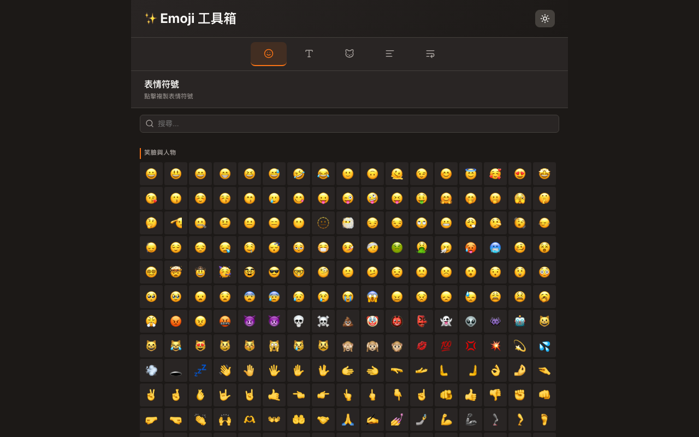

# Emoji 工具箱 使用說明

## 這是什麼？
一站式表情符號、特殊符號、顏文字瀏覽器，點擊即複製到剪貼簿。

## 使用方式
1. 上方分頁切換：表情符號 / 文字符號 / 顏文字 / 空白處理 / 換行工具
2. 用搜尋框輸入中文名稱搜尋（如「笑」「箭頭」「愛心」）
3. 點擊任意符號，自動複製到剪貼簿
4. 滑鼠移到符號上可看到中文名稱提示

## 功能特色
- 5,235 個 emoji/符號/顏文字，全部附中文名稱
- 搜尋支援中文名稱比對
- 點擊即複製，快速使用
- 深色/淺色主題切換
- RWD 自適應排版
- 空白字元處理與換行工具

## 注意事項
- 部分符號在不同裝置上顯示可能略有差異
- 線上版：https://miku4ocean.github.io/text-emoji/
